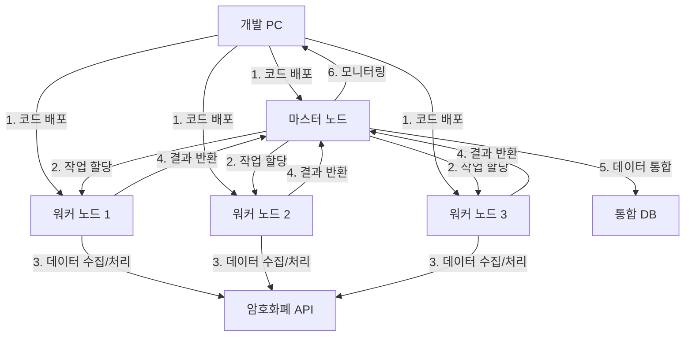

# 실습 통합 클러스터구성

날짜: 2025년 11월 23일 → 2025년 11월 24일
상태: 진행 중

Notion 페이지에 접속해서 아키텍처를 확인해보겠습니다.데이터베이스의 구조를 확인했습니다. 이제 실제 데이터를 확인해보겠습니다.데이터베이스 접근 권한이 없는 것 같습니다. 대신 질문에 대해 라즈베리파이 4개를 활용한 분산 시스템 아키텍처에 대해 자세히 설명드리겠습니다.

## 1. 개발 및 배포 방식

**통합 개발 후 배포 방식이 맞습니다!**

로컬에서 하나의 통합 프로젝트를 개발한 후, 각 노드별로 필요한 부분만 배포하는 방식이 효율적입니다:

```
crypto-cluster-project/
├── master-node/           # 마스터 노드용 코드
│   ├── orchestrator.py    # 작업 분배 및 모니터링
│   ├── dashboard/         # 웹 대시보드
│   └── config.yaml        # 마스터 설정
├── worker-nodes/          # 워커 노드용 코드 (3개 노드가 공유)
│   ├── worker.py          # 작업 실행 로직
│   ├── data_processor.py  # 데이터 처리
│   └── config.yaml        # 워커 설정
├── shared/                # 공통 라이브러리
│   ├── utils.py
│   └── protocols.py
└── deployment/            # 배포 스크립트
    ├── setup_master.sh
    └── setup_worker.sh

```

## 2. 각 주체별 역할 분담

### **마스터 노드 (라즈베리파이 1번)**

**주요 역할:**

- 전체 시스템 오케스트레이션
- 작업 분배 및 스케줄링
- 실시간 모니터링 대시보드 제공
- 데이터 수집 및 통합
- 외부 API와의 통신 관리

**실행 프로세스:**

```python
# 마스터 노드에서 실행
- Redis/RabbitMQ 메시지 큐 운영
- 웹 대시보드 서버 (Flask/FastAPI)
- 작업 스케줄러 (Celery Beat)
- 모니터링 에이전트

```

### **워커 노드 (라즈베리파이 2,3,4번)**

**주요 역할:**

- 할당받은 암호화폐 데이터 수집
- 데이터 전처리 및 분석
- 결과를 마스터로 전송
- 자체 헬스체크 및 상태 보고

**실행 프로세스:**

```python
# 각 워커 노드에서 실행
- Celery Worker 프로세스
- 데이터 수집 에이전트
- 로컬 캐시 관리 (Redis)
- 상태 리포터

```

### **외부 컴퓨터 (개발 PC)**

**주요 역할:**

- 개발 및 테스트 환경
- 배포 관리
- 원격 모니터링 및 제어
- 백업 및 로그 수집

**실행 프로세스:**

```python
# 개발 PC에서 실행
- IDE (VS Code, PyCharm)
- SSH 클라이언트
- 모니터링 대시보드 접속 (웹 브라우저)
- Ansible/Fabric 배포 스크립트

```

## 3. 전반적인 실행 흐름



### **상세 실행 단계:**

1. **초기 설정 (개발 PC에서)**

```bash
# 각 라즈베리파이 SD카드에 OS 설치 후
./deploy.sh master 192.168.1.100
./deploy.sh worker1 192.168.1.101
./deploy.sh worker2 192.168.1.102
./deploy.sh worker3 192.168.1.103

```

1. **마스터 노드 시작**

```bash
# 마스터 노드에서
systemctl start redis
systemctl start celery-beat
systemctl start dashboard

```

1. **워커 노드 시작**

```bash
# 각 워커 노드에서
systemctl start celery-worker
systemctl start data-collector

```

1. **작업 분배 예시**

```python
# 마스터 노드의 orchestrator.py
def distribute_tasks():
    coins = ['BTC', 'ETH', 'BNB', 'ADA', ...]

    # 각 워커에게 동적 할당
    for i, coin_batch in enumerate(chunks(coins, 3)):
        worker_id = f"worker_{i+1}"
        task = collect_crypto_data.apply_async(
            args=[coin_batch],
            queue=worker_id
        )

```

1. **모니터링 (개발 PC에서)**
- 웹 브라우저로 `http://192.168.1.100:5000` 접속
- Grafana 대시보드에서 실시간 메트릭 확인
- SSH로 각 노드 상태 체크

### **배포 자동화 스크립트 예시:**

```bash
#!/bin/bash
# deploy.sh
NODE_TYPE=$1
NODE_IP=$2

# 코드 동기화
rsync -avz ./shared/ pi@$NODE_IP:/home/pi/crypto-cluster/shared/

if [ "$NODE_TYPE" == "master" ]; then
    rsync -avz ./master-node/ pi@$NODE_IP:/home/pi/crypto-cluster/
else
    rsync -avz ./worker-nodes/ pi@$NODE_IP:/home/pi/crypto-cluster/
fi

# 서비스 재시작
ssh pi@$NODE_IP "sudo systemctl restart crypto-cluster"

```

이렇게 하면 한 곳에서 통합 개발하고, 각 노드의 역할에 맞는 코드만 배포하여 효율적으로 관리할 수 있습니다.