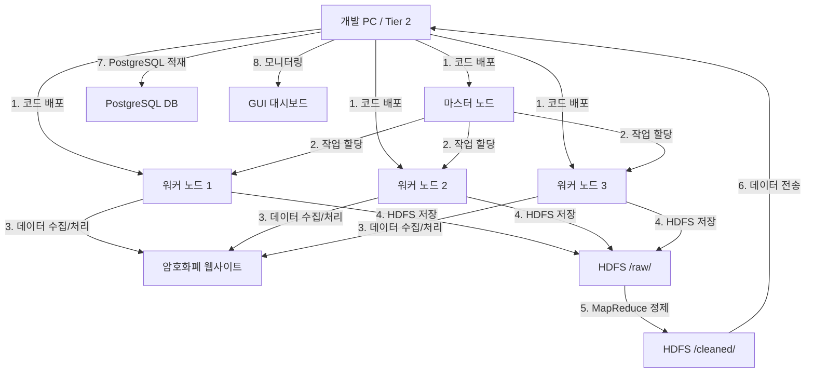

# 실습 통합 클러스터 구성

**최종 업데이트**: 2025-12-08

PICU 프로젝트의 라즈베리파이 클러스터 구성 및 배포 방식을 설명합니다.

## 1. 개발 및 배포 방식

**통합 개발 후 배포 방식**

로컬에서 하나의 통합 프로젝트를 개발한 후, 각 노드별로 필요한 부분만 배포하는 방식이 효율적입니다:

```
PICU/
├── cointicker/
│   ├── master-node/           # 마스터 노드용 코드
│   │   ├── orchestrator.py    # 파이프라인 오케스트레이션
│   │   └── scheduler.py        # Scrapyd 스케줄러
│   ├── worker-nodes/           # 워커 노드용 코드 (3개 노드가 공유)
│   │   ├── cointicker/         # Scrapy 프로젝트
│   │   │   └── spiders/        # 5개 Spider 구현
│   │   └── mapreduce/          # MapReduce 작업
│   ├── shared/                 # 공통 라이브러리
│   │   ├── hdfs_client.py      # HDFS 클라이언트
│   │   ├── logger.py           # 로깅 유틸리티
│   │   └── path_utils.py      # 경로 유틸리티
│   ├── config/                 # 설정 파일
│   │   ├── spider_config.yaml  # Spider 스케줄 설정
│   │   ├── cluster_config.yaml # 클러스터 설정
│   │   └── database_config.yaml # 데이터베이스 설정
│   └── gui/                    # GUI 통합 관리 시스템
│       ├── core/               # 핵심 모듈
│       ├── modules/            # 기능 모듈
│       └── ui/                  # UI 탭 컴포넌트
└── deployment/                 # 배포 스크립트
    ├── setup_master.sh         # 마스터 노드 설정
    ├── setup_worker.sh         # 워커 노드 설정
    └── deploy_to_cluster.sh    # 클러스터 배포
```

## 2. 각 주체별 역할 분담

### **마스터 노드 (라즈베리파이 1번)**

**주요 역할**:

- 전체 시스템 오케스트레이션
- 작업 분배 및 스케줄링
- HDFS NameNode (메타데이터 관리)
- YARN ResourceManager (작업 스케줄링)
- Orchestrator (파이프라인 오케스트레이션)
- Scrapyd Scheduler (크롤링 작업 스케줄링)

**실행 프로세스**:

```bash
# 마스터 노드에서 실행
- Hadoop NameNode
- YARN ResourceManager
- Orchestrator (master-node/orchestrator.py)
- Scrapyd Scheduler (master-node/scheduler.py)
- Scrapyd 서버
```

**서비스 관리**:

```bash
# Orchestrator 서비스
sudo systemctl start orchestrator
sudo systemctl status orchestrator

# Scrapyd 서비스
sudo systemctl start scrapyd
sudo systemctl status scrapyd
```

### **워커 노드 (라즈베리파이 2,3,4번)**

**주요 역할**:

- 할당받은 암호화폐 데이터 수집
- 데이터 전처리 및 분석
- HDFS DataNode (블록 저장)
- YARN NodeManager (작업 실행)

**Spider 배치**:

- **Worker 1**: Upbit + Perplexity 크롤링
- **Worker 2**: Coinness + CNN 크롤링
- **Worker 3**: SaveTicker 크롤링

**실행 프로세스**:

```bash
# 각 워커 노드에서 실행
- Hadoop DataNode
- YARN NodeManager
- Scrapy Spiders (worker-nodes/cointicker/spiders/)
- MapReduce 작업 (worker-nodes/mapreduce/)
```

### **외부 컴퓨터 (개발 PC / Tier 2 서버)**

**주요 역할**:

- 개발 및 테스트 환경
- 배포 관리
- 원격 모니터링 및 제어
- GUI 통합 관리 시스템 실행
- PostgreSQL 데이터베이스 운영
- FastAPI Backend 서버
- React Frontend 서버

**실행 프로세스**:

```bash
# 개발 PC에서 실행
- GUI 애플리케이션 (cointicker/gui/)
- FastAPI Backend (cointicker/backend/)
- React Frontend (cointicker/frontend/)
- PostgreSQL 데이터베이스
- Tier 2 Scheduler (scripts/run_pipeline_scheduler.py)
```

## 3. 전반적인 실행 흐름



### **상세 실행 단계**

1. **초기 설정 (개발 PC에서)**

```bash
# 각 라즈베리파이 SD카드에 OS 설치 후
cd PICU/deployment
./setup_master.sh 192.168.1.100
./setup_worker.sh 192.168.1.101
./setup_worker.sh 192.168.1.102
./setup_worker.sh 192.168.1.103
```

2. **마스터 노드 시작**

```bash
# 마스터 노드에서
# Hadoop 시작
start-dfs.sh
start-yarn.sh

# Orchestrator 시작
cd ~/cointicker
python master-node/orchestrator.py

# 또는 systemd 서비스로
sudo systemctl start orchestrator

# Scrapyd Scheduler 시작
python master-node/scheduler.py

# 또는 systemd 서비스로
sudo systemctl start scrapyd
```

3. **워커 노드 시작**

```bash
# 각 워커 노드에서
# Hadoop DataNode 시작 (마스터 노드에서 start-dfs.sh 실행 시 자동 시작)
# YARN NodeManager 시작 (마스터 노드에서 start-yarn.sh 실행 시 자동 시작)

# Scrapy Spider는 Orchestrator/Scrapyd Scheduler가 자동으로 실행
```

4. **Tier 2 서버 시작 (개발 PC에서)**

```bash
# PostgreSQL 시작
sudo systemctl start postgresql

# Tier 2 Scheduler 시작
cd ~/cointicker
python scripts/run_pipeline_scheduler.py

# 또는 systemd 서비스로
sudo systemctl start tier2-scheduler

# FastAPI Backend 시작
cd ~/cointicker/backend
uvicorn app:app --host 0.0.0.0 --port 5000

# React Frontend 시작
cd ~/cointicker/frontend
npm run dev

# GUI 통합 관리 시스템 시작
cd ~/PICU
bash scripts/run_gui.sh
```

5. **작업 분배 예시**

```python
# 마스터 노드의 orchestrator.py
def run_crawlers(self):
    """크롤링 작업 실행"""
    spiders = ['upbit_trends', 'saveticker', 'coinness', 'perplexity']

    for spider_name in spiders:
        # Scrapyd를 통해 Spider 실행
        self.schedule_spider(spider_name)
```

6. **모니터링 (개발 PC에서)**

- GUI 애플리케이션에서 실시간 모니터링
- 웹 브라우저로 `http://localhost:5173` 접속 (React Frontend)
- SSH로 각 노드 상태 체크

## 4. 배포 자동화 스크립트

### 배포 스크립트 예시

```bash
#!/bin/bash
# deploy_to_cluster.sh

# 마스터 노드 배포
MASTER_IP="192.168.1.100"
rsync -avz --exclude 'venv' --exclude '__pycache__' \
  ./cointicker/master-node/ \
  ubuntu@$MASTER_IP:/home/ubuntu/cointicker/master-node/

rsync -avz --exclude 'venv' --exclude '__pycache__' \
  ./cointicker/shared/ \
  ubuntu@$MASTER_IP:/home/ubuntu/cointicker/shared/

rsync -avz --exclude 'venv' --exclude '__pycache__' \
  ./cointicker/config/ \
  ubuntu@$MASTER_IP:/home/ubuntu/cointicker/config/

# 워커 노드 배포
WORKER_IPS=("192.168.1.101" "192.168.1.102" "192.168.1.103")

for WORKER_IP in "${WORKER_IPS[@]}"; do
  rsync -avz --exclude 'venv' --exclude '__pycache__' \
    ./cointicker/worker-nodes/ \
    ubuntu@$WORKER_IP:/home/ubuntu/cointicker/worker-nodes/

  rsync -avz --exclude 'venv' --exclude '__pycache__' \
    ./cointicker/shared/ \
    ubuntu@$WORKER_IP:/home/ubuntu/cointicker/shared/
done

# 서비스 재시작
ssh ubuntu@$MASTER_IP "sudo systemctl restart orchestrator"
ssh ubuntu@$MASTER_IP "sudo systemctl restart scrapyd"

for WORKER_IP in "${WORKER_IPS[@]}"; do
  ssh ubuntu@$WORKER_IP "sudo systemctl restart hadoop-datanode"
  ssh ubuntu@$WORKER_IP "sudo systemctl restart hadoop-nodemanager"
done
```

## 5. 네트워크 구성

### 네트워크 설정

**마스터 노드**:

- IP: 192.168.1.100
- 역할: NameNode, ResourceManager, Orchestrator, Scrapyd Scheduler

**워커 노드 1**:

- IP: 192.168.1.101
- 역할: DataNode, NodeManager, Upbit + Perplexity 크롤링

**워커 노드 2**:

- IP: 192.168.1.102
- 역할: DataNode, NodeManager, Coinness + CNN 크롤링

**워커 노드 3**:

- IP: 192.168.1.103
- 역할: DataNode, NodeManager, SaveTicker 크롤링

**Tier 2 서버 (개발 PC)**:

- IP: 192.168.1.10 (또는 localhost)
- 역할: PostgreSQL, FastAPI Backend, React Frontend, GUI

### 네트워크 설정 파일

**위치**: `PICU/deployment/netplan-*.yaml`

각 노드별로 netplan 설정 파일을 배포하여 네트워크를 구성합니다.

## 6. 서비스 관리

### systemd 서비스

**Tier 1 서비스**:

- `orchestrator.service`: Orchestrator 서비스
- `scrapyd.service`: Scrapyd 서비스

**Tier 2 서비스**:

- `tier2-scheduler.service`: Tier 2 Scheduler 서비스
- `postgresql.service`: PostgreSQL 서비스

**서비스 생성 스크립트**:

```bash
# Orchestrator 서비스 생성
cd PICU/deployment
bash create_orchestrator_service.sh

# Scrapyd 서비스 생성
bash create_scrapyd_service.sh

# Tier 2 Scheduler 서비스 생성
bash create_tier2_scheduler_service.sh
```

## 7. 모니터링 및 관리

### GUI 통합 관리 시스템

GUI 애플리케이션을 통해 모든 노드와 서비스를 중앙에서 관리할 수 있습니다:

- **클러스터 탭**: 라즈베리파이 노드 상태 모니터링
- **Tier2 탭**: FastAPI Backend 및 PostgreSQL 상태 확인
- **모듈 탭**: 모든 모듈 상태 및 제어
- **제어 탭**: 파이프라인 수동 실행
- **설정 탭**: 중앙 설정 관리

### 로그 모니터링

```bash
# 모든 로그 동시 모니터링
bash scripts/monitor_logs.sh

# 또는 GUI에서 로그 모니터링 메뉴 선택
```

## 8. 문제 해결

### 일반적인 문제

1. **네트워크 연결 실패**

   - 각 노드의 네트워크 설정 확인
   - 방화벽 설정 확인
   - SSH 연결 테스트

2. **HDFS 연결 실패**

   - NameNode 상태 확인: `hdfs dfsadmin -report`
   - DataNode 상태 확인: 각 워커 노드에서 `jps` 명령어로 확인

3. **Spider 실행 실패**

   - Scrapyd 서버 상태 확인: `curl http://localhost:6800/listprojects.json`
   - 프로젝트 배포 확인: `scrapyd-deploy`

4. **DB 연결 실패**
   - PostgreSQL 서비스 상태 확인: `sudo systemctl status postgresql`
   - 데이터베이스 설정 확인: `cointicker/config/database_config.yaml`

---

**최종 업데이트**: 2025-12-08
**버전**: 2.0 (2-Tier 아키텍처 기반)
