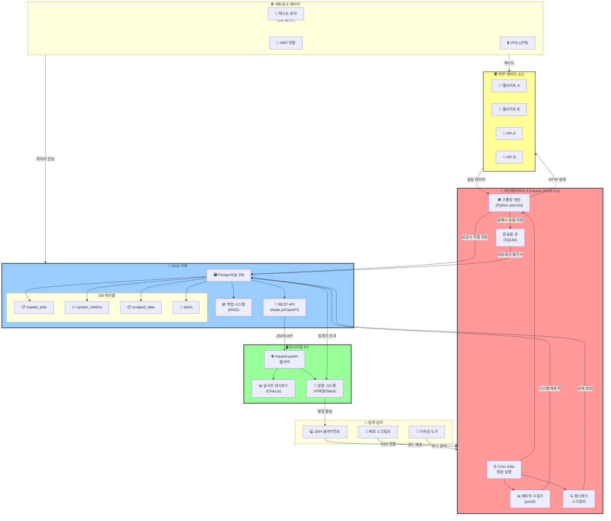
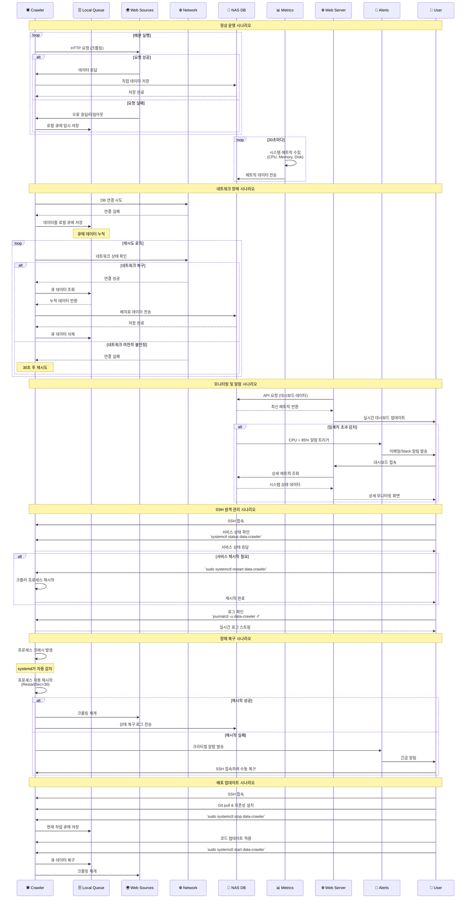
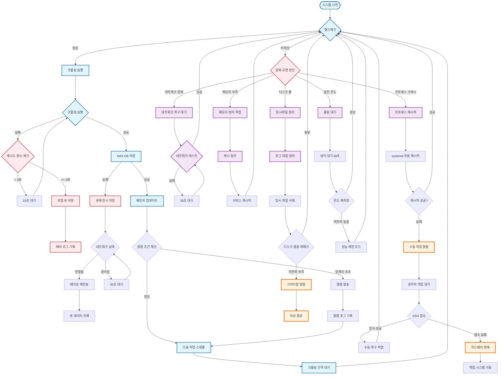

# 파이프라인 아키텍처 설계

상태: 완료

# 24/7 데이터 크롤링 파이프라인 최적 설계

## 1. 시스템 아키텍처

### 1.1 하드웨어 구성

- **크롤러**: 라즈베리파이 3 (우분투 20.04 CLI)
- **저장소**: NAS (PostgreSQL/MySQL)
- **모니터링**: 별도 디바이스 또는 NAS 활용

### 1.2 소프트웨어 스택

```
┌─ 라즈베리파이 3 ─┐    ┌─ NAS ─┐    ┌─ 모니터링 ─┐
│ • 크롤링 엔진     │    │ • DB  │    │ • 웹 대시보드 │
│ • 메트릭 수집     │ ←→ │ • API │ ←→ │ • 알람 시스템 │
│ • 상태 리포팅     │    │ • 로그 │    │ • 실시간 차트  │
└─────────────────┘    └──────┘    └──────────────┘
```

## 2. 핵심 컴포넌트 설계

### 2.1 크롤링 엔진 (라즈베리파이)

```bash
# systemd 서비스로 관리
# /etc/systemd/system/data-crawler.service
[Unit]
Description=24/7 Data Crawler
After=[network.target](http://network.target)

[Service]
Type=simple
User=crawler
ExecStart=/opt/crawler/[main.py](http://main.py)
Restart=always
RestartSec=30
StandardOutput=journal
StandardError=journal

[Install]
WantedBy=[multi-user.target](http://multi-user.target)
```

### 2.2 메트릭 수집 시스템

- **시스템 메트릭**: CPU, Memory, Disk, Network
- **비즈니스 메트릭**: 크롤링 성공률, 처리 속도, 에러 카운트
- **수집 주기**: 30초마다 (성능 부하 고려)

### 2.3 데이터베이스 스키마

```sql
-- NAS PostgreSQL 테이블 구조
CREATE TABLE crawler_jobs (
    id SERIAL PRIMARY KEY,
    job_name VARCHAR(100),
    status VARCHAR(20),
    start_time TIMESTAMP,
    end_time TIMESTAMP,
    records_processed INTEGER,
    error_message TEXT
);

CREATE TABLE system_metrics (
    id SERIAL PRIMARY KEY,
    timestamp TIMESTAMP DEFAULT NOW(),
    cpu_usage DECIMAL(5,2),
    memory_usage DECIMAL(5,2),
    disk_usage DECIMAL(5,2),
    temperature DECIMAL(4,1),
    network_status BOOLEAN
);

CREATE TABLE scraped_data (
    id SERIAL PRIMARY KEY,
    source VARCHAR(100),
    data JSONB,
    scraped_at TIMESTAMP DEFAULT NOW(),
    processed BOOLEAN DEFAULT FALSE
);
```

## 3. 모니터링 시스템

### 3.1 실시간 대시보드 구성

- **시스템 상태**: CPU/메모리/온도 실시간 차트
- **크롤링 상태**: 작업 진행률, 에러율, 처리량
- **데이터 현황**: 수집된 데이터량, 저장 상태
- **알람 현황**: 장애 알림, 임계치 초과 경고

### 3.2 경량 웹 서버 (Flask 기반)

```python
# 라즈베리파이 리소스 고려한 경량 구현
from flask import Flask, jsonify, render_template
import psutil
import requests

app = Flask(__name__)

@app.route('/api/system')
def system_status():
    return jsonify({
        'cpu': psutil.cpu_percent(),
        'memory': psutil.virtual_memory().percent,
        'disk': psutil.disk_usage('/').percent,
        'temperature': get_cpu_temperature()
    })

@app.route('/dashboard')
def dashboard():
    return render_template('dashboard.html')
```

## 4. 장애 대응 및 복원력

### 4.1 자동 복구 메커니즘

- **프로세스 모니터링**: systemd watchdog 활용
- **네트워크 장애**: 재시도 로직 + 백오프 전략
- **DB 연결 실패**: 로컬 큐잉 + 배치 동기화
- **SD카드 보호**: tmpfs 활용, 로그 순환

### 4.2 알람 시스템

```yaml
# 알람 설정 예시
alerts:
  - name: high_cpu_usage
    condition: cpu_usage > 85%
    duration: 5m
    actions:
      - email: [admin@company.com](mailto:admin@company.com)
      - slack: #monitoring
      
  - name: crawler_failure
    condition: crawler_error_rate > 10%
    duration: 2m
    actions:
      - restart_service: data-crawler
      - notify: critical
```

## 5. 성능 최적화

### 5.1 라즈베리파이 최적화

```bash
# SD카드 수명 연장
echo "tmpfs /tmp tmpfs defaults,size=100M 0 0" >> /etc/fstab
echo "tmpfs /var/log tmpfs defaults,size=50M 0 0" >> /etc/fstab

# 스왑 최적화
echo "vm.swappiness=10" >> /etc/sysctl.conf

# CPU 거버너 설정
echo "performance" > /sys/devices/system/cpu/cpu0/cpufreq/scaling_governor
```

### 5.2 크롤링 최적화

- **비동기 처리**: asyncio + aiohttp 활용
- **레이트 제한**: 사이트별 요청 간격 조절
- **캐싱**: Redis/메모리 캐시로 중복 요청 방지
- **배치 처리**: DB 쓰기를 배치로 묶어서 처리

## 6. 배포 및 운영

### 6.1 배포 자동화

```bash
#!/bin/bash
# [deploy.sh](http://deploy.sh)
git pull origin main
pip install -r requirements.txt
sudo systemctl restart data-crawler
sudo systemctl restart monitoring-web
```

### 6.2 로그 관리

- **구조화된 로깅**: JSON 형태로 통일
- **로그 레벨**: DEBUG(개발), INFO(운영), ERROR(알람)
- **로그 순환**: logrotate로 자동 관리

### 6.3 백업 전략

- **코드 백업**: Git repository (GitHub/GitLab)
- **데이터 백업**: NAS RAID + 일일 백업
- **설정 백업**: /etc, crontab 등 시스템 설정

## 7. 운영 가이드

### 7.1 일일 체크리스트

- [ ]  시스템 리소스 확인 (CPU, 메모리, 온도)
- [ ]  크롤링 작업 상태 확인
- [ ]  DB 연결 상태 확인
- [ ]  에러 로그 검토
- [ ]  디스크 사용량 모니터링

### 7.2 장애 대응 절차

1. **장애 감지**: 알람 시스템 또는 모니터링 대시보드
2. **초기 진단**: SSH 접속하여 시스템 상태 확인
3. **서비스 재시작**: `sudo systemctl restart data-crawler`
4. **로그 분석**: `journalctl -u data-crawler -f`
5. **근본 원인 분석**: 시스템/네트워크/애플리케이션 레벨 조사

### 7.3 성능 튜닝 포인트

- **크롤링 간격 조정**: 사이트 부하 고려
- **배치 크기 최적화**: DB 쓰기 성능 vs 메모리 사용량
- **캐시 전략**: 히트율 vs 메모리 사용량
- **네트워크 타임아웃**: 안정성 vs 응답성

## 8. 확장성 고려사항

### 8.1 수평 확장

- **멀티 크롤러**: 여러 라즈베리파이로 작업 분산
- **로드밸런싱**: 크롤링 대상 사이트별 분할
- **메시지 큐**: Redis/RabbitMQ로 작업 큐잉

### 8.2 수직 확장

- **하드웨어 업그레이드**: 라즈베리파이 4/5로 교체
- **저장소 확장**: NAS 용량/성능 증설
- **네트워크 최적화**: 유선 연결, 전용 VLAN

---

이 설계는 8GB SD카드, 라즈베리파이 3의 제약사항을 고려하면서도 안정적인 24/7 운영이 가능하도록 구성되었습니다.

## NAS 활용방안

파이프라인을 단계별로 점검해보겠습니다.

## 1. 라즈베리파이 24/7 크롤링

### 강점

- 저전력으로 지속적 운영 가능
- CLI 환경으로 리소스 효율성 극대화
- systemd로 자동 재시작 가능

### 취약점 및 대응

**SD카드 내구성**: 8GB 환경에서 지속적 쓰기가 가장 큰 위험

```bash
# 필수 대응
tmpfs /var/log tmpfs defaults,size=50M 0 0
tmpfs /tmp tmpfs defaults,size=100M 0 0

```

**네트워크 의존성**: 인터넷 연결 장애 시 전체 파이프라인 중단

- 로컬 큐잉 메커니즘 필요
- 네트워크 복구 시 자동 재시도

**단일 장애점**: 하드웨어 고장 시 복구 시간 필요

- 백업 라즈베리파이 준비 권장

## 2. NAS DB 저장 및 네트워킹

### 강점

- 대용량 저장소 활용
- RAID를 통한 데이터 안정성
- 네트워크를 통한 데이터 중앙화

### 점검 포인트

**네트워크 대역폭**: 크롤링 데이터량에 따른 병목 가능성

- 데이터 압축/배치 처리 고려
- NAS와의 연결 안정성 모니터링

**DB 성능**: 동시 쓰기/읽기 처리 능력

```sql
-- 인덱스 최적화 필수
CREATE INDEX idx_scraped_data_timestamp ON scraped_data(scraped_at);
CREATE INDEX idx_system_metrics_timestamp ON system_metrics(timestamp);

```

**백업 전략**: NAS 장애 시 데이터 손실 방지

- 정기적 백업 스케줄 필요
- 클라우드 백업 고려

## 3. 별도 PC 모니터링 웹서버

### 장점

- 라즈베리파이 리소스 절약
- 풍부한 시각화 가능
- 독립적 장애 대응

### 구현 시 고려사항

**전력 효율성**: 24/7 운영 시 전력 비용

- 필요시에만 웹서버 가동하는 방안 고려
- Wake-on-LAN으로 원격 부팅

**보안**: 웹 인터페이스 노출 위험

```bash
# 기본 보안 설정
- HTTPS 인증서
- 방화벽 설정
- 인증 시스템 (최소 Basic Auth)

```

## 전체 파이프라인 위험도 평가

### 높은 위험

1. **SD카드 고장**: 라즈베리파이 전체 중단
2. **네트워크 장애**: 데이터 수집 중단
3. **NAS 장애**: 데이터 저장 불가

### 중간 위험

1. **크롤링 대상 사이트 변경**: 파싱 로직 실패
2. **IP 차단**: 일시적 수집 중단
3. **메모리 누수**: 장기간 운영 시 성능 저하

## 개선 권장사항

### 즉시 필요한 개선

```bash
# 1. 헬스체크 스크립트
*/5 * * * * /opt/scripts/health_check.sh

# 2. 로그 순환 설정
/var/log/crawler/*.log {
    daily
    rotate 7
    compress
    delaycompress
}

# 3. 모니터링 메트릭 수집
*/1 * * * * python3 /opt/scripts/collect_metrics.py

```

### 장기적 개선

- 백업 크롤러 시스템 구축
- 클라우드 백업 연동
- 컨테이너화로 배포 간소화

이 파이프라인은 기본적으로 견고하지만, SD카드 내구성과 네트워크 의존성이 가장 큰 취약점입니다. 이 두 부분에 대한 대비책이 필수적입니다.

# 도식화







24/7 데이터 크롤링 파이프라인의 구체적인 흐름을 Mermaid 다이어그램으로 시각화하겠습니다.이제 데이터 플로우와 제어 흐름을 구체적으로 보여주는 시퀀스 다이어그램도 만들어보겠습니다.이제 장애 상황별 대응 플로우차트도 만들어보겠습니다.세 개의 다이어그램을 통해 24/7 데이터 크롤링 파이프라인을 구체화했습니다:

## 1. 시스템 아키텍처 다이어그램

전체 시스템의 구성요소와 데이터 흐름을 보여줍니다. 라즈베리파이, NAS, 모니터링 PC 간의 관계와 각각의 역할이 명확히 구분되어 있습니다.

## 2. 시퀀스 다이어그램

실제 운영에서 발생하는 다양한 시나리오를 시간순으로 보여줍니다:

- 정상 크롤링 프로세스
- 네트워크 장애 시 로컬 큐잉과 복구
- 모니터링 및 알람 처리
- SSH를 통한 원격 관리
- 시스템 장애와 자동 복구

## 3. 장애 대응 플로우차트

각종 장애 상황에 대한 구체적인 대응 절차를 보여줍니다. 네트워크 장애, 메모리 부족, 디스크 풀, 온도 상승 등 실제 운영에서 마주칠 수 있는 문제들에 대한 자동화된 대응 방안이 포함되어 있습니다.

이 다이어그램들이 보여주는 핵심 포인트:

**견고성**: 다중 장애 대응 메커니즘과 자동 복구 기능
**관찰가능성**: 실시간 모니터링과 알람 시스템
**유지보수성**: SSH를 통한 원격 관리와 배포 자동화
**확장성**: 모듈화된 구조로 향후 확장 가능

8GB SD카드와 라즈베리파이 3의 제약 조건 하에서도 안정적인 24/7 운영이 가능한 현실적인 설계입니다.

---